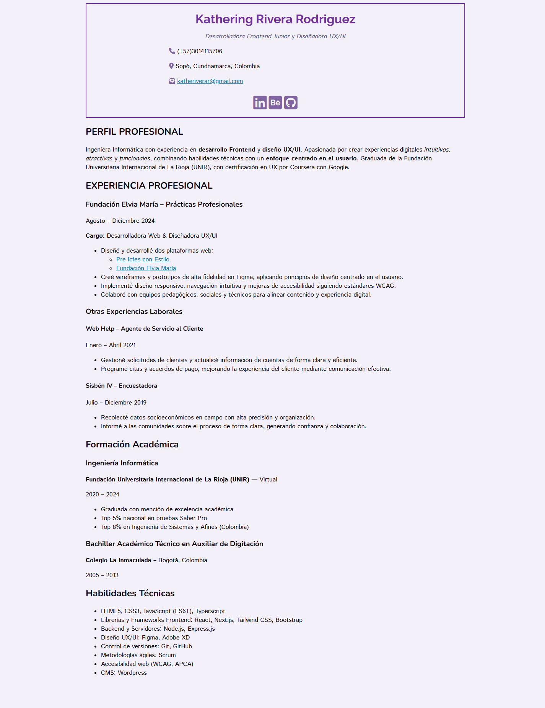

# 💼 CV de Kathering Rivera

Este proyecto es una página web personal que presenta mi CV  como Desarrolladora Frontend Junior y Diseñadora UX/UI. Está construido con HTML5 y CSS3 con enfoque en semántica, accesibilidad, y buenas prácticas para SEO.


## 🛠️ Tecnologías usadas

- HTML5 (estructura semántica)
- CSS3 (diseño personalizado y responsive)
- Font Awesome (íconos)
- Google Fonts (tipografía)
- Favicon
- Metaetiquetas SEO y OG
- Responsive Design y Accesibilidad

## 📂 Estructura del proyecto

```
📁 proyecto-cv
├── index.html
├── styles.css
├── favicon.ico
└── README.md
```

## 🧰 ¿Cómo correr el proyecto localmente?

1. Clona este repositorio:

```bash
git clone https://github.com/kattrr/nombre-del-repositorio.git
```

2. Abre el archivo `index.html` en tu navegador.

No se necesitan dependencias ni instalación adicional.




## 🙋 Sobre mí

Soy Kathering Rivera Rodríguez, ingeniera informática especializada en desarrollo frontend y diseño de experiencias centradas en el usuario. Este CV muestra mi perfil profesional, habilidades técnicas y proyectos relevantes.

## 📬 Contacto

- 📧 [katheriverar@gmail.com](mailto:katheriverar@gmail.com)
- 🌐 [LinkedIn](https://www.linkedin.com/in/katheringriverar/)
- 🎨 [Behance](https://www.behance.net/katherivera)
- 💻 [GitHub](https://github.com/kattrr)

## 🧠 Créditos

Este CV hace parte del reto propuesto por [roadmap.sh - Single Page CV](https://roadmap.sh/projects/single-page-cv), una iniciativa para construir un portafolio HTML desde cero con buenas prácticas semánticas, SEO y diseño accesible.

## 📝 Licencia

Este proyecto está licenciado bajo [CC BY-NC 4.0](https://creativecommons.org/licenses/by-nc/4.0/).  
Se permite reutilizar y modificar el contenido con atribución, pero **no con fines comerciales**.  
**Los datos personales aquí incluidos no deben copiarse ni reproducirse.**
